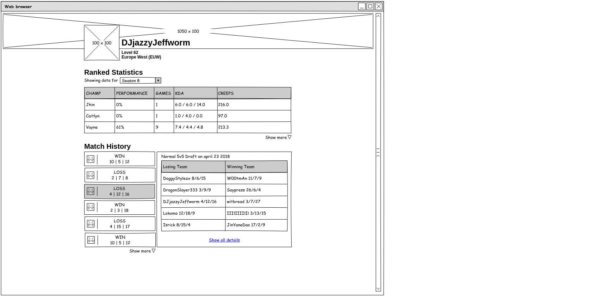

This site is build using ReactJS and Redux. Unfortunately development has already
stopped. The API provided by Riot Games has changed. Many endpoints were
deprecated and removed to reduce the stress on their servers, including the one
I planned to use. Where it was once possible to query basic information about
all matches for a user, one must now fetch both basic and more detailed
information match for match. This makes it extremely hard to show a list of
matches without hurting loading times.

Even though this project was never finished it still provided me with new knowledge.
Therefore I will not delete this repository just yet and use it
to list some of the things I learned, so I can look back at them in the future.

- If you do not want your api key floating around github it is possible to
  import it from a different file, which is included in the .gitignore file.

- If you make requests to third party apis from javascript the api key can be
  found with the use of the developers console. To circumvent this and keep
  your key secret you could create an intermediary layer on your own server.

- Pencil can be used to create a quick wireframe for your project which helps
  the development by providing a visual. 

- You must take into consideration some requests will return with an error
  status code and can not be used to populate components.

- It can be quite tricky to work with a couple modules because their versions
  need to be compatible.
